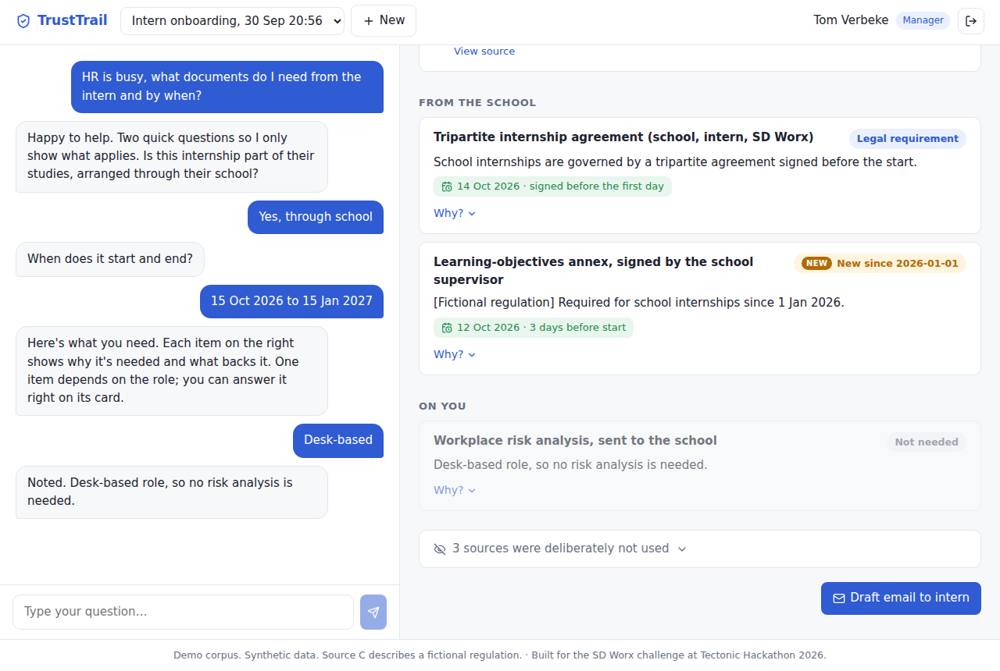
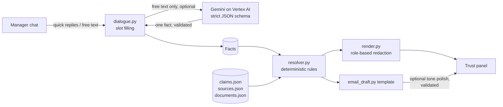

# TrustTrail

> ⚠️ **Demo corpus. Synthetic data. Source C describes a fictional regulation.** No real people, emails or regulations are used.

**TrustTrail turns "I found something" into "I understand why I can rely on it."**
A hiring manager asks what documents an intern needs. TrustTrail answers, and labels every item with *why* it's needed, *what authority* backs it (law, policy, HR email, Teams chat), whether older guidance is now *outdated*, and, where one unknown fact decides it, *who to ask*.
Built for the SD Worx challenge (*Unlock the Knowledge Within*) at Tectonic Hackathon 2026.



## The demo story

Tom (manager) onboards a school intern starting 15 Oct 2026. After two quick questions the trust panel shows:

| Doc | Label | Why you can trust it |
|---|---|---|
| IT & confidentiality acknowledgement | **Established practice** | Only stated by HR in a Teams chat. We say so. |
| Tripartite internship agreement | **Legal requirement** | Legal note on school internships |
| Learning-objectives annex | **New since 2026-01-01** | Fictional circular. The March 2025 HR email that says "only the agreement" is flagged **outdated** |
| Workplace risk analysis | **Depends on the role** | Only if manual tasks. Ask Marc Peeters (Prevention Advisor). Answer "Desk-based" and it flips to **Not needed** |

Three sources are shown as **deliberately not used**: a Dutch policy (wrong country), the employee checklist (wrong contract type) and an **unowned** checklist.
Sources containing other people's personal data are shown to managers only as redacted summaries; HR sees the original. Managers can flag outdated guidance to its owner, and it lands in HR's inbox.

## Architecture: code decides, the LLM only phrases



- **The resolver decides.** Which documents apply, their status, staleness and deadlines are computed from structured claims by pure functions (`backend/app/resolver.py`). Same input, same answer, every time.
- **The LLM only phrases** (optional, `USE_LLM=true`): it parses a free-text chat reply into the *one* fact being asked, and polishes the email tone. Its output is schema-checked; the email falls back to the template if any document name or date goes missing.
- **Everything works with `USE_LLM=false`** (quick-reply buttons + template email). That's the default.
- `backend/scripts/extract_claims.py` shows how claims would be LLM-extracted from raw sources at scale, for owner review. It is not run live; the demo uses committed, reviewed claims.

## How to run

Requirements: Python 3.11+, Node 18+.

```bash
cp .env.example .env          # set DEMO_PASSWORD (all demo users share it)
cd backend
python -m venv .venv && source .venv/bin/activate
pip install -r requirements.txt
uvicorn app.main:app --port 8000
```

In a second terminal:

```bash
cd frontend
npm install
npm run dev                   # http://localhost:5173 (proxies /api to :8000)
```

Log in as `tom` (manager), `lina` (manager) or `katrien` (HR) with your `DEMO_PASSWORD`. If it's unset, the backend prints a generated password once at startup.

Tests: `cd backend && python -m pytest -q` (resolver + security, 21 tests).

### Optional: Gemini (Vertex AI)

```bash
gcloud auth login
gcloud config set project <PROJECT_ID>
gcloud services enable aiplatform.googleapis.com
gcloud auth application-default login     # no key files in the repo
```

Then set `USE_LLM=true`, `GCP_PROJECT`, `GCP_LOCATION` and `GEMINI_MODEL` (copy the exact Gemini Flash model ID from Vertex AI Model Garden).

## Environment variables

| Variable | Purpose | Default |
|---|---|---|
| `DEMO_PASSWORD` | Password for all seeded demo users | random, printed once |
| `SESSION_SECRET` | HMAC key for stored session-token hashes | random per start |
| `FRONTEND_ORIGIN` | Only origin allowed by CORS | `http://localhost:5173` |
| `USE_LLM` | Enable Gemini parsing / email polish | `false` |
| `GCP_PROJECT`, `GCP_LOCATION` | Vertex AI project and region | –, `europe-west1` |
| `GEMINI_MODEL` | Exact Gemini model ID | – |
| `ELEVENLABS_API_KEY`, `ELEVENLABS_VOICE_ID` | Reserved for the stretch "Listen" feature (not built) | – |
| `DB_PATH` | SQLite file | `backend/trusttrail.db` |

## Security measures

- Passwords hashed with bcrypt; none in code (from `DEMO_PASSWORD` or generated at startup)
- Server-side sessions: random 32-byte token in an `HttpOnly`, `SameSite=Strict` cookie (`Secure` off localhost), stored only as an HMAC hash, 8-hour expiry, deleted on logout
- Login rate limit: 5 failures per username per 5 minutes; one generic error message; constant-time path for unknown users
- **Ownership check on every `/cases/{id}` route**: someone else's case returns **404**, not 403 (HR may read any case, but only owners can change one)
- Role always read from the server session, never from request bodies or headers
- `/flags` and `/flags/{id}/resolve` are HR-only
- One serializer (`backend/app/render.py`) decides source visibility: managers never receive `raw_text`
- `PATCH /cases/{id}/facts` accepts only whitelisted facts with typed values (`extra="forbid"`)
- LLM output is untrusted: strict schema, can only set the one fact being asked, never used for authorization; user and source text is wrapped in delimiters with an instruction to ignore embedded instructions
- Input limits: message ≤ 1000 chars, flag note ≤ 500 chars
- CORS restricted to `FRONTEND_ORIGIN`; API docs endpoints disabled
- No stack traces in API responses (generic 500 handler)
- No secrets in the repo: `.env`, `*.db` and service-account JSON are git-ignored; `.env.example` has names only

## Choices where the spec was open

- SQLite via the stdlib `sqlite3` module (no ORM).
- The frontend proxies `/api` through Vite so the session cookie stays same-origin.
- Free-text answers without the LLM get "Please pick one of the options" plus the buttons again.
- A "Via VDAB / Actiris / Forem" internship has no matching rules in the demo corpus, so the panel says nothing applies and to check with HR.
- `PATCH /facts` whitelists only `manual_tasks` (the only fact answered from a card); the other facts are set through the dialogue, which validates them the same way.

## What's unfinished / next steps

- Live extraction from real Teams, SharePoint and email (today: committed synthetic corpus)
- Owner notifications by email when their source is flagged (today: HR inbox only)
- More document types and contract types
- Multilingual support (NL/FR)
- ElevenLabs "Listen" button (stretch goal, not built)
- Gemini path is implemented with fallbacks but was not verified against live credentials in this build
